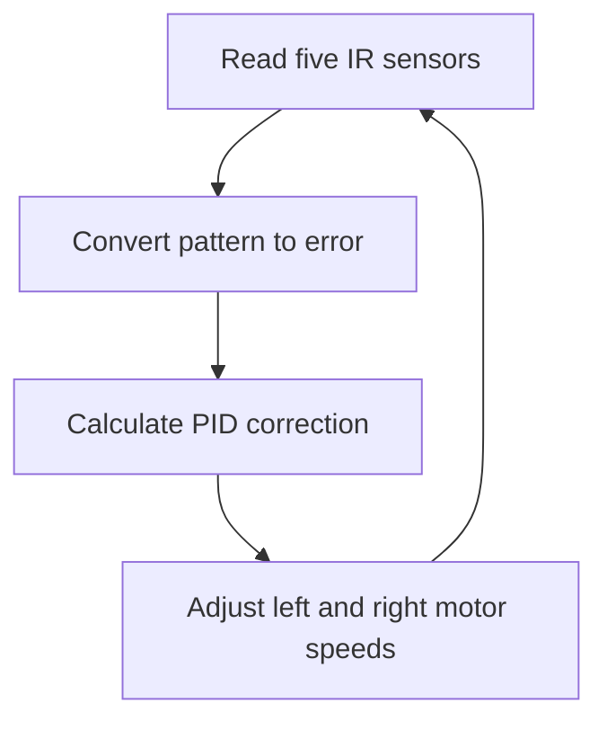

# PID Line-Following Robot


An Arduino-based robot that follows a dark line using five infrared sensors and PID control. Two continuous-rotation servos provide differential steering, while an optional Android interface communicates over Bluetooth for manual driving and real-time PID tuning.

> This README is an original summary of Marcelo Rovai's [Line Follower Robot – PID Control – Android Setup](https://www.instructables.com/Line-Follower-Robot-PID-Control-Android-Setup/).


## Features

- Five-sensor line detection
- Proportional or full PID steering control
- Differential speed control using two continuous-rotation servos
- Stop-marker and lost-line handling
- Optional HC-06 Bluetooth connection
- Android-based adjustment of `Kp`, `Ki`, and `Kd`
- Manual forward, backward, left, right, and stop commands

## Project Gallery


<table>
  <tr>
    <td align="center" width="50%">
      <br>
      <sub>Sample Schematics of the project</sub>
    </td>
    </tr>
  <tr>
    <td align="center" width="50%">
      <br>
      <sub>Five-sensor array mounted beneath the chassis</sub>
    </td>
  </tr>

</table>

<p align="center"><sub>Project images by Marcelo Rovai / MJRoBot. See the <a href="https://www.instructables.com/Line-Follower-Robot-PID-Control-Android-Setup/">original tutorial</a>.</sub></p>

## How It Works

The sensors are arranged from left to right and read the surface below the robot. A dark line produces a digital `HIGH`, while a light background produces a digital `LOW`.

The sensor pattern is translated into an error from `-4` to `+4`:

| Sensor pattern | Position of line | Error |
|:---:|---|---:|
| `10000` | Far left | -4 |
| `11000` | Left | -3 |
| `01000` | Moderately left | -2 |
| `01100` | Slightly left | -1 |
| `00100` | Centered | 0 |
| `00110` | Slightly right | +1 |
| `00010` | Moderately right | +2 |
| `00011` | Right | +3 |
| `00001` | Far right | +4 |

The controller calculates a correction:

```text
P = error
I = I + error
D = error - previousError

correction = (Kp × P) + (Ki × I) + (Kd × D)
```

That correction is applied to the two motors in opposite directions. One motor slows down while the other speeds up, steering the robot back toward the center of the line.

## Control Loop



The firmware uses three operating states:

| State | Trigger | Action |
|---|---|---|
| `FOLLOWING_LINE` | A valid line pattern is detected | Run the PID controller |
| `STOPPED` | All sensors detect the dark stop marker | Stop both motors |
| `NO_LINE` | No sensor detects the line | Stop and search for the line |

## Hardware

### Electronics

- Arduino Nano
- 5 × TCRT5000-compatible digital IR line sensors
- 2 × continuous-rotation servos
- HC-06 Bluetooth module *(optional)*
- Push button
- Status LED
- Breadboard and jumper wires
- Separate battery supplies for the controller and servos

### Chassis

- Two-wheel robot frame
- Two wheels
- Ball caster
- Sensor mounting bar
- Fasteners or removable mounting strips

## Pin Assignment

| Component | Arduino pin |
|---|---:|
| Left servo signal | D5 |
| Right servo signal | D3 |
| Start button | D9 |
| Status LED | D13 |
| Bluetooth TX → Arduino RX | D10 |
| Bluetooth RX ← Arduino TX | D11 |
| Sensor 0, far left | D12 |
| Sensor 1 | A4 / D18 |
| Sensor 2, center | A3 / D17 |
| Sensor 3 | A2 / D16 |
| Sensor 4, far right | A5 / D19 |

> All modules must share a common ground. Confirm voltage requirements before connecting the Bluetooth module or power supplies.

## Setup

1. Assemble the chassis with the two drive servos and caster.
2. Mount the five sensors in a straight row close to the floor.
3. Wire the sensors, servos, button, LED, and optional Bluetooth module.
4. Calibrate each continuous-rotation servo so a `1500 µs` signal produces a complete stop.
5. Adjust each sensor's potentiometer so it reliably distinguishes the dark line from the light background.
6. Upload the Arduino firmware using the Arduino IDE.
7. Place the robot over the track, start at a low motor power, and tune the controller.

## PID Tuning

A practical tuning sequence is:

1. Set `Ki = 0` and `Kd = 0`.
2. Increase `Kp` until the robot follows the line quickly but begins to oscillate.
3. Reduce `Kp` slightly.
4. Increase `Kd` gradually to reduce overshoot and stabilize turns.
5. Add only a small `Ki` value if a persistent offset remains.
6. Re-test after changing motor power, sensor height, track width, or loop delay.

| Symptom | Adjustment |
|---|---|
| Robot reacts too slowly | Increase `Kp` |
| Robot swings repeatedly across the line | Reduce `Kp` or increase `Kd` |
| Robot responds sharply and becomes unstable | Reduce the relevant gain |
| Robot keeps a small steady offset | Add a small `Ki` value |

The Android interface speeds up tuning by sending new gains over Bluetooth without recompiling the Arduino sketch.

## Bluetooth Commands

| Command | Meaning |
|---|---|
| `f` | Move forward |
| `b` | Move backward |
| `l` | Turn left |
| `r` | Turn right |
| `s` | Stop |
| `g` | Start line-following mode |
| `p/XXX` | Set proportional gain |
| `i/XXX` | Set integral gain |
| `d/XXX` | Set derivative gain |

`XXX` represents a value selected in the Android application. The original interface was built with MIT App Inventor.

## Recommended Test Order

- Verify each servo independently.
- Confirm both servos stop at their neutral pulse values.
- Test forward, backward, left, and right movement.
- Print and verify all five sensor readings.
- Test the error mapping by moving the sensor bar across the line by hand.
- Begin with proportional control at low speed.
- Add derivative control, then optional integral control.
- Test Bluetooth tuning only after normal line following works.

## Notes

- Continuous-rotation servos mounted opposite each other require opposite pulse directions for forward motion.
- Sensor spacing should allow both one-sensor and two-sensor line patterns.
- Motor power, mechanical alignment, battery level, sensor height, and loop timing all affect the best PID gains.
- Bluetooth is optional; fixed gain values can be stored directly in the firmware.

## Reference and Credit

Project concept and technical reference: Marcelo Rovai, [Line Follower Robot – PID Control – Android Setup](https://www.instructables.com/Line-Follower-Robot-PID-Control-Android-Setup/). The referenced project was published under GPLv3; verify the license of any source code or assets you reuse.

## License

If this repository contains code derived from the referenced GPLv3 project, distribute that code under the terms of the [GNU General Public License v3.0](https://www.gnu.org/licenses/gpl-3.0.html). Add a `LICENSE` file before publishing.
